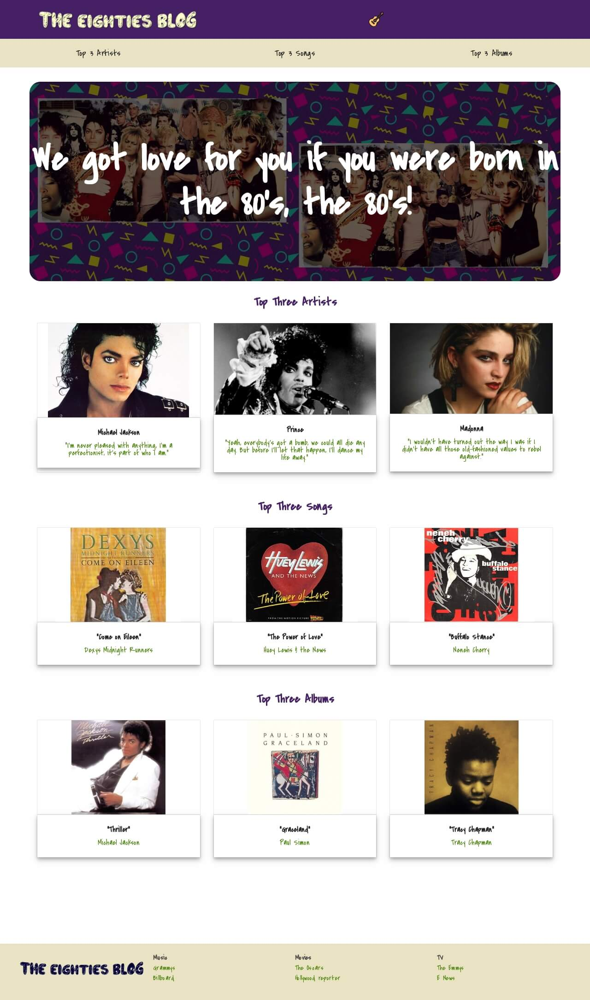

# Personal Blog Website

> This project showcases how to utilize HTML and CSS to build out a personal blog website, including custom images, layout, and styling.

 

## The Eighties Blog

## Installation

### Setup

* Clone the repo `git clone https://github.com/thepembeweb/personal-blog-website.git`
* Open the index.html file in your browser to run the website

Alternatively you can view the website [here](https://thepembeweb.github.io/personal-blog-website/index.html).

## Built With

* [HTML](https://en.wikipedia.org/wiki/HTML) - The markup language used
* [CSS](https://en.wikipedia.org/wiki/Cascading_Style_Sheets) - The style sheet language used

## Authors

* **[Pemberai Sweto](https://github.com/thepembeweb)** - *Initial work* - [Personal Blog Website](https://github.com/thepembeweb/personal-blog-website)

## License

- This project is licensed under the MIT License - see the [LICENSE.md](LICENSE.md) file for details
- Copyright 2020 © [Pemberai Sweto](https://github.com/thepembeweb).

